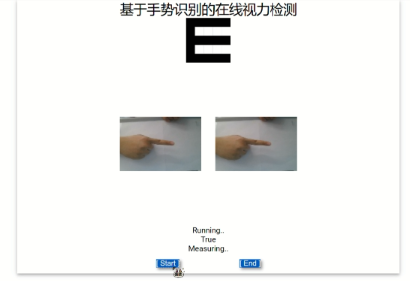

# Eyesight-Check-by-gesture-recognition
## 项目简介
本项目是一个基于手势识别的视力检测Web程序。模型为基于 `MobileNetV2` 预训练+初中学生自行拍摄的手势照片训练而成。手势照片训练集见 `视力检测/dataset`，最终使用的模型见 `视力检测/out_file/hands_new.onnx`。
## 使用方法
运行 `ver1.3.ipynb`，将会在浏览器中打开一个本地Web程序，如下图所示。  
  
左边画面为摄像机实时捕捉。右边画面为自动拍照的截图，用于识别手势指向。  
测试时，被测者站立距离电脑屏幕约5m。根据提示音操作，可得到大致的视力范围，如“高度近视”，“中度近视”等，并有相对应的语音建议播放。
## 注意事项
本项目旨在让初中学生体验AI科创过程，仅仅为一个科创概念的实现，与实际医疗建议无关。
## Introduction
This project is a web app for eyesight checks based on gesture recognition. The model used in the process is pretrained on `MobileNetV2` then trained on a gesture dataset made by some junior high school students. The gesture dataset can be found in `视力检测/dataset`. The model finally used can be found in `视力检测/out_file/hands_new.onnx`.
## Usage
Run `ver1.3.ipynb`, and a local web app will be open in the browser, as shown below.  
    
The window on the left displays a live video stream from the camera, and the window on the right shows the image used for direction recognition captured automatically.  
When running the test, the volunteer should stand 5m away from the screen. Follow the sound instruction, and an approximate result will be generated, such as "severely short-sighted", or "moderately short-sighted", etc. Meanwhile, an audio clip of advice on protecting eyes will be played.
## Attention!
All the audio contents are in Chinese.  
This project is meant to let junior high school students experience how to apply AI to science projects. It is only made to display a scientific idea, and has nothing to do with real-life medical advice.
